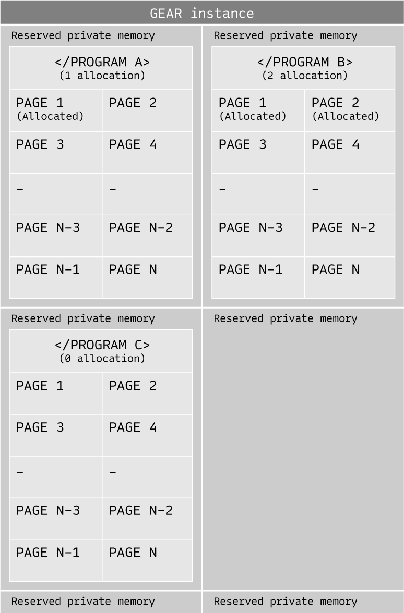

As any blockchain system, **Gear** maintains distributed state. Runtime code compiled to WebAssembly becomes a part of the blockchain’s storage state. **Gear** enables a defining feature of forkless runtime upgrades. The state is also guaranteed to be finalized if the finality gadget is used.

Storage state includes the following components:
- Programs and memory (includes program’s code and its private memory)
- Message queue (global message queue of the network)
- Accounts (network accounts and their balances)

## Programs and memory

Programs (smart contracts) are first-class citizens in the **Gear** instance state.

Program code is stored as an immutable Wasm blob. Each program has a fixed amount of individual memory which is reserved for a program during its initialization and persists between message-handling (so-called static area). **Gear** instance holds individual memory space per program and guarantees its persistence.

A program can read and write only within its own exclusively allocated memory space and has no access to the memory space of other programs. Individual memory space is reserved for a program during its initialization and does not require additional fee (included in the program initialization fee).

Programs can allocate more memory from the memory pool provided by a **Gear** instance. A program can allocate the required amount of memory pages in blocks of 64KB. Each additional memory block allocation requires a gas fee.

Each allocated memory block is stored separately on the distributed database backend, but at the run time when a program accesses its memory, **Gear** node constructs continuous runtime memory and allows programs to run on it without reloads. **Gear** node uses lazy load technique so pages are brought into memory if the executing process demands them instead of loading all pages immediately. A program's state and its memory are saved each time after the program normally completes execution. 

Utilizing a persistent memory is critical to ensuring the success of data-intensive dApps. The traditional approach of loading the program each time it needs to be addressed seems not optimized here. Decentralized applications with many-to-many relationships benefit from a persistent memory approach.

## Message queue

**Gear** instance holds a global message queue. Using **Gear** node, users can send transactions with one or several messages to a particular program(s). This fills up the message queue. During block construction, messages are dequeued and routed to the particular program.

## Accounts

For a public network, in order to be protected against DoS attacks a gas/fee for transaction processing is required. **Gear** provides a balance module that allows to store user and program balances and pay a transaction fee.

Regular balance transfer is performed inside the Substrate Balances module. Balance is transferred between users, program and validator accounts.

In addition to regular balance transfer, **Gear** network defines gas balance transfer that is used to reward validator nodes for their work and allows the network to be protected from DoS attacks.

In general, a particular **Gear** network instance can be defined as both permissioned and permissionless, public blockchain. In the permissioned scenario, no balance module is required.
